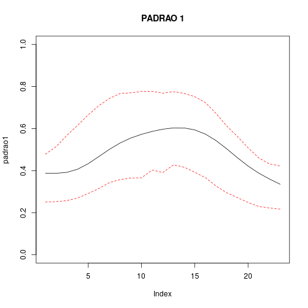
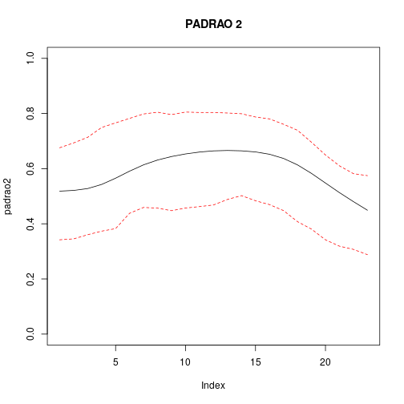
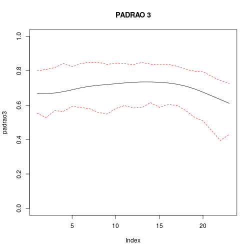
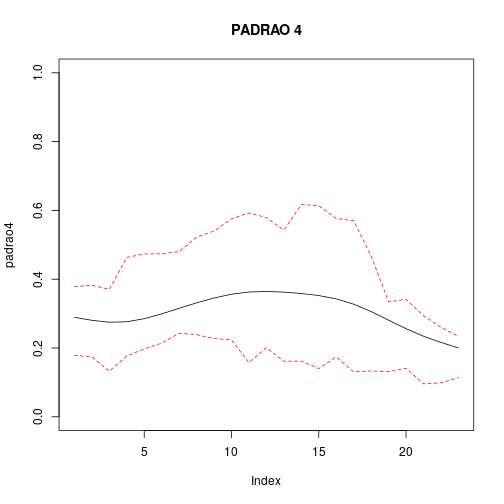
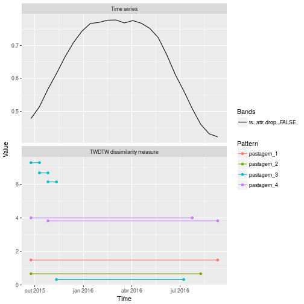
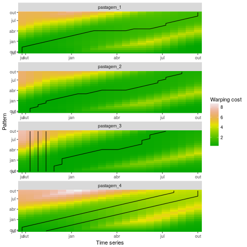

LIMIARES DO TWDTW PARA ESTABELECER NÍVEL DE CORTE PARA PASTAGEM
========================================================
author: CLAUDINEI OLIVEIRA-SANTOS
date: 15-09-2017
autosize: true

Definindo limiares
========================================================

inserir figura com exemplos de limiares


Limiares de cada padrão
========================================================





Slide With Plot
========================================================


```
[1] "dist_patt 1 = " "1.48"          
```

```
[1] "dist_patt 2 = " "0.66"          
```

```
[1] "dist_patt 3 = " "0.32"           "6.15"           "6.68"          
[5] "7.29"          
```

```
[1] "dist_patt 4 = " "3.82"           "4"             
```




